# 📖 Cẩm nang Phát triển EduManager (Developer Guide)

Chào mừng bạn đến với tài liệu hướng dẫn kỹ thuật dành cho dự án **EduManager** — giải pháp quản lý phòng máy tính mạng LAN tối ưu, chuyên nghiệp và mã nguồn mở. Tài liệu này cung cấp cái nhìn toàn diện về kiến trúc hệ thống, các cơ chế hoạt động cốt lõi, cách thức tích hợp mã nguồn C# để can thiệp hệ thống Windows, cũng như lộ trình phát triển kế tiếp.

---

## 1. Tổng quan & Kiến trúc Hệ thống

EduManager là phần mềm giám sát và điều phối phòng máy học sinh trong mạng nội bộ (mạng LAN), đóng vai trò thay thế cho các phần mềm thương mại đắt đỏ như NetSupport School hay NetOp School. 

Dự án được xây dựng theo mô hình **Monorepo** chia làm 2 ứng dụng chính:
1. **Teacher App (Giáo viên):** Đóng vai trò là **Server** (máy chủ) điều phối lớp học và giao diện quản trị (Dashboard).
2. **Student App (Học sinh):** Đóng vai trò là **Client** (máy khách), chạy ẩn dưới nền (System Tray), liên tục cập nhật trạng thái và nhận lệnh thực thi từ máy Giáo viên.

### Sơ đồ luồng dữ liệu tổng quan
```mermaid
graph TD
    subgraph Máy Giáo Viên (Teacher)
        T_UI[React JS Dashboard] <-->|IPC Bridge| T_Electron[Electron Main Process]
        T_Electron <-->|Tích hợp Socket.IO Server| T_Socket[Socket.IO Server - Port 3722]
    end

    subgraph Máy Học Sinh (Student)
        S_Socket[Socket.IO Client] <-->|Nhận Lệnh / Gửi Ảnh / Gửi Bài| T_Socket
        S_Electron[Electron Main Process] <-->|Quản lý Kết Nối & Đóng Gói| S_Socket
        S_Electron <-->|IPC Bridge| S_UI[React UI Setup/Lock/Broadcast]
        
        %% Tích hợp Windows API nâng cao
        S_Electron <-->|stdin/stdout| BlockKeys[BlockKeys.exe C# Helper]
        S_Electron <-->|stdin/stdout| InputSim[InputSimulator.exe C# Helper]
        S_Electron -->|Ghi đè| HostsFile[C:\\Windows\\System32\\drivers\\etc\\hosts]
    end
    
    style T_UI fill:#1e293b,stroke:#3b82f6,stroke-width:2px,color:#fff
    style T_Electron fill:#0f172a,stroke:#3b82f6,stroke-width:2px,color:#fff
    style S_UI fill:#1e293b,stroke:#10b981,stroke-width:2px,color:#fff
    style S_Electron fill:#0f172a,stroke:#10b981,stroke-width:2px,color:#fff
    style BlockKeys fill:#312e81,stroke:#6366f1,stroke-width:1px,color:#fff
    style InputSim fill:#312e81,stroke:#6366f1,stroke-width:1px,color:#fff
    style HostsFile fill:#78350f,stroke:#f59e0b,stroke-width:1px,color:#fff
```

---

## 2. Công nghệ Sử dụng (Tech Stack)

*   **Framework Desktop:** [Electron.js](https://www.electronjs.org/) (phiên bản `^42.4.1`) quản lý vòng đời ứng dụng và gọi API hệ điều hành.
*   **Giao diện người dùng:** [React.js](https://react.dev/) (phiên bản `^18.3.1`) kết hợp với CSS thuần (Vanilla CSS) tối ưu hiệu năng và tính thẩm mỹ cao (curated dark-mode, glassmorphism, responsive grid).
*   **Trình đóng gói & Dev Server:** [Vite](https://vite.dev/) tăng tốc độ hot-reload khi lập trình.
*   **Truyền thông điệp Real-time:** [Socket.IO](https://socket.io/) (phiên bản `^4.7.5`) truyền tín hiệu nhị phân, lệnh điều khiển, và tin nhắn văn bản qua TCP.
*   **Xử lý Logic Hệ thống (Windows):** Hợp dịch các file **C# (.NET Framework 4.0)** để móc nối bàn phím/chuột (Low-level hooks) và mô phỏng sự kiện phần cứng (Win32 SendInput).

---

## 3. Cấu trúc Thư mục Dự án

```text
edumanager/
├── README.md                      # Hướng dẫn cài đặt cơ bản và chạy ứng dụng
├── GUIDE.md                       # Tài liệu hướng dẫn lập trình chi tiết này
│
├── teacher/                       # Dự án App Giáo viên (Server)
│   ├── electron/
│   │   ├── main.js                # Nhúng Socket.IO Server, quản lý IPC và cửa sổ
│   │   ├── logger.js              # Ghi log hoạt động hệ thống ra file CSV/LOG
│   │   └── preload.js             # Cầu nối bảo mật (IPC bridge) cho React UI
│   ├── src/
│   │   ├── components/            # Các Panel chức năng chính (WebBlock, AppBlock, FileTransfer, Chat...)
│   │   ├── App.jsx                # Layout chính, nhận kết nối socket và cập nhật Grid
│   │   └── main.jsx               # Điểm khởi đầu của React UI
│   ├── package.json               # Cấu hình builder và các script của Teacher
│   └── vite.config.js             # Cấu hình Vite cho Teacher
│
└── student/                       # Dự án App Học sinh (Client)
    ├── electron/
    │   ├── main.js                # Socket Client, quản lý vòng lặp giám sát, trigger C# helper
    │   ├── preload.js             # Cầu nối IPC cho màn hình Setup/Lock/Broadcast
    │   ├── hostsManager.js        # Ghi/xóa IP chuyển hướng trong C:\Windows\System32\drivers\etc\hosts
    │   ├── BlockKeys.cs           # Mã nguồn C# chặn tổ hợp phím hệ thống (Alt+Tab, Win...)
    │   ├── BlockKeys.exe          # File thực thi đã biên dịch để chặn phím
    │   ├── InputSimulator.cs      # Mã nguồn C# chặn phần cứng thật và nhận lệnh giả lập
    │   └── InputSimulator.exe     # File thực thi đã biên dịch để giả lập đầu vào
    ├── src/
    │   ├── pages/
    │   │   ├── SetupPage.jsx      # Điền thông tin kết nối và quản lý File/Chat
    │   │   ├── LockPage.jsx       # Giao diện khóa màn hình toàn cảnh
    │   │   └── BroadcastPage.jsx  # Xem màn hình giáo viên thời gian thực
    │   └── App.jsx                # Định tuyến (React Router) các trạng thái màn hình
    └── package.json               # Cấu hình builder và các script của Student
```

---

## 4. Các Cơ chế Hoạt động & Dòng chảy Dữ liệu (Core Mechanisms)

### A. Quét Card Mạng LAN và Khởi chạy Server (Teacher)
Khi ứng dụng Giáo viên khởi chạy:
1. `teacher/electron/main.js` quét các card mạng qua API `os.networkInterfaces()`.
2. Hệ thống lọc bỏ các IP ảo thuộc về phần mềm ảo hóa (như VMware, VirtualBox, WSL, Hamachi...) để lấy đúng IP card mạng LAN vật lý thật nhằm hiển thị cho giáo viên.
3. Socket.IO Server tự động lắng nghe trên cổng mặc định **`3722`** của tất cả các card mạng (`0.0.0.0`).
4. Khi học sinh điền IP của giáo viên và bấm kết nối từ Student App, socket client sẽ liên kết tới địa chỉ `ws://<IP-Teacher>:3722`.

---

### B. Cơ chế Khóa Màn hình Cứng & Chặn Phím Hệ thống
Tính năng khóa màn hình được triển khai chặt chẽ để học sinh không thể thoát hoặc vô hiệu hóa:

1. **Khởi tạo cửa sổ chặn:** Khi nhận lệnh `command:lock`, Electron sẽ khởi tạo một cửa sổ `lockWindow` phủ toàn màn hình (`fullscreen: true`, `kiosk: true`, `alwaysOnTop: true`, `skipTaskbar: true`). Cửa sổ này liên tục ép focus (`blur` -> `focus()`) ngăn chặn các hành động nhấp chuột ra ngoài.
2. **Can thiệp tổ hợp phím ở cấp OS:** Các phím tắt như `Alt+Tab`, `Win`, `Ctrl+Esc`, `Alt+F4` không thể chặn triệt để bằng Electron API. Do đó, EduManager triển khai giải pháp:
    *   Tự động phát hiện và biên dịch mã nguồn `BlockKeys.cs` thành `BlockKeys.exe` tại thư mục khởi chạy bằng trình biên dịch sẵn có của Windows (`C:\Windows\Microsoft.NET\Framework\v4.0.30319\csc.exe`).
    *   Khi bật chế độ khóa, Electron dùng lệnh `spawn()` để khởi động `BlockKeys.exe`.
    *   `BlockKeys` cài đặt một móc phím bàn phím cấp thấp (`WH_KEYBOARD_LL` Win32 Hook) để lọc và tiêu hủy (trả về `1`) các sự kiện bấm phím hệ thống trước khi hệ điều hành xử lý.
3. **Mở khóa:** Khi nhận tín hiệu `command:unlock`, Electron gửi lệnh tắt tiến trình `BlockKeys.exe` (`kill()`), đồng thời cho phép đóng cửa sổ `lockWindow`.

> [!WARNING]
> Phím tắt khẩn cấp: Trong quá trình chạy thử nghiệm trên cùng một máy (vừa mở app Teacher vừa mở app Student), bạn có thể sử dụng tổ hợp phím tắt giải cứu `Ctrl + Shift + U` trên màn hình setup của học sinh để ép đóng màn hình khóa.

---

### C. Theo dõi và Truyền Ảnh Màn hình Thu nhỏ (Thumbnail Grid)
Nhằm tối ưu hóa hiệu năng, giảm tải cho CPU (Main Process) và giảm tối đa băng thông truyền tải mạng LAN, hệ thống sử dụng cơ chế stream phần cứng thông qua renderer process:
1. **Lấy nguồn màn hình (Main Process):** Khi kết nối thành công, Electron Main Process gọi API `desktopCapturer.getSources()` **một lần duy nhất** để lấy ID của màn hình chính, sau đó gửi sự kiện `'capture:start'` qua IPC kèm theo `sourceId` và chu kỳ `interval` sang Renderer Process.
2. **Khởi tạo Stream phần cứng (Renderer Process):**
    *   SetupPage (React) nhận sự kiện và sử dụng `navigator.mediaDevices.getUserMedia` để mở luồng ghi hình màn hình (được tăng tốc phần cứng bởi Chromium).
    *   Tắt tính năng tối ưu hóa Chromium bằng cấu hình `backgroundThrottling: false` để đảm bảo stream hoạt động liên tục ngay cả khi ứng dụng thu nhỏ xuống khay hệ thống (System Tray).
3. **Nén ảnh và Gửi dữ liệu:**
    *   Luồng ghi hình được gắn vào một thẻ `<video>` ẩn và vẽ sang một `<canvas>` ẩn theo chu kỳ (3 giây/lần ở chế độ thường).
    *   Mỗi khung hình được chuyển đổi thành chuỗi base64 JPEG với chất lượng nén **50%** (`canvas.toDataURL('image/jpeg', 0.5)`). Điều này giúp giảm dung lượng ảnh xuống chỉ còn **20KB - 40KB** (giảm tới **95%** dung lượng so với ảnh PNG lossless mặc định của Electron).
    *   Renderer gửi ảnh nén qua IPC ngược lại Main Process để gửi qua Socket.IO tới giáo viên.

---

### D. Kiểm soát Ứng dụng (App Blocking)
Hệ thống cho phép giáo viên theo dõi và kiểm soát các phần mềm chạy trên máy học sinh:
1. Giáo viên gửi danh sách từ khóa ứng dụng cần chặn kèm chế độ (`mode: 'kill'` hoặc `mode: 'warn'`).
2. Cứ mỗi **2 giây**, Student App chạy hai tác vụ kiểm tra ngầm song song:
    *   **Tên tiến trình (Process Name):** Thực thi lệnh `tasklist /FO CSV /NH` để lấy danh sách tiến trình đang chạy và so khớp từ khóa.
    *   **Tiêu đề cửa sổ (Window Title):** Chạy PowerShell ngầm `Get-Process | Where-Object {$_.MainWindowTitle -ne ''}` để tìm các cửa sổ chứa từ khóa cấm.
3. Nếu phát hiện vi phạm:
    *   Học sinh gửi socket event `student:app-violation` về máy giáo viên để hiển thị lên bảng nhật ký (Logs).
    *   Nếu là chế độ **`kill`**: Hệ thống gọi lệnh `taskkill /F /IM "<process>.exe"` hoặc PowerShell `Stop-Process` để đóng ngay lập tức phần mềm vi phạm.
    *   Nếu là chế độ **`warn`**: Hệ thống mở một màn hình overlay cảnh báo học sinh trong **8 giây** yêu cầu tự tắt phần mềm, sau đó tự đóng cảnh báo.

---

### E. Kiểm soát Website (Web Blocking)
Để chặn các trình duyệt web truy cập vào các trang mạng xã hội, game online hoặc trang web không lành mạnh, EduManager kết hợp 2 lớp phòng vệ (Two-Layer Blocking):

```mermaid
sequenceDiagram
    participant T as Máy Giáo viên
    participant S_Main as Student Main (Electron)
    participant Hosts as File Hosts (Windows)
    participant PS as PowerShell Monitor
    participant Browser as Trình duyệt Học sinh

    T->>S_Main: Yêu cầu khóa Web [domains]
    
    rect rgb(20, 30, 50)
        note right of S_Main: LỚP 1: DNS Sinkhole (hosts)
        S_Main->>Hosts: Ghi đè "127.0.0.1 domain.com"
        S_Main->>S_Main: Thực thi 'ipconfig /flushdns'
        Browser->>Hosts: Truy vấn IP của domain.com
        Hosts-->>Browser: Trả về 127.0.0.1 (Không tải được trang)
    end

    rect rgb(30, 20, 20)
        note right of S_Main: LỚP 2: Giám sát Tiêu đề Cửa sổ (PowerShell)
        S_Main->>PS: Get-Process | WindowTitle
        PS-->>S_Main: Danh sách tiêu đề (vd: "Facebook - Google Chrome")
        S_Main->>S_Main: Phát hiện chứa từ khóa cấm
        S_Main->>PS: Stop-Process (Đóng trình duyệt)
    end
```



1.  **Lớp 1 (DNS Sinkhole - hosts):** File `student/electron/hostsManager.js` thực thi lệnh mở khóa thuộc tính Read-Only của file cấu hình hệ thống `C:\Windows\System32\drivers\etc\hosts`. Sau đó ghi danh sách tên miền cần chặn trỏ về địa chỉ Loopback `127.0.0.1` và thực hiện xóa bộ nhớ đệm DNS bằng `ipconfig /flushdns`.
2.  **Lớp 2 (Window Title Check - PowerShell Fallback):** Đối với các trang web sử dụng HTTPS hoặc DNS Cache cứng khó can thiệp bằng file hosts, vòng lặp giám sát của Student sẽ quét tiêu đề của tất cả trình duyệt đang mở (Chrome, Edge, Firefox...). Nếu tiêu đề trình duyệt chứa từ khóa của website bị cấm (ví dụ: `facebook`), tiến trình trình duyệt đó sẽ bị ép đóng ngay lập tức thông qua lệnh PowerShell.

---

### F. Truyền nhận File (File Transfer) & Thu Bài
EduManager truyền tải dữ liệu trực tiếp thông qua luồng gói tin nhị phân cắt nhỏ (Chunk-based transfer) để tránh rò rỉ bộ nhớ RAM:

| Chiều truyền tải | Quy trình hoạt động |
| :--- | :--- |
| **Giáo viên gửi tài liệu cho Học sinh** | 1. Giáo viên chọn file từ hộp thoại hệ thống.<br>2. File được chia thành các mảnh nhỏ kích thước **256KB** (Chunk) và mã hóa Base64.<br>3. Gửi tuần tự qua socket. Học sinh nhận ghép lại thành Buffer gốc.<br>4. Lưu trực tiếp vào thư mục chỉ định của học sinh (Desktop, Downloads, Documents...). |
| **Thu bài thi / bài tập của Học sinh** | 1. Học sinh click "Nộp bài" trên giao diện Setup.<br>2. Chọn file bài tập và gửi dữ liệu dạng Chunk về Server.<br>3. Server tự động gom các mảnh ghép, tạo thư mục con theo tên máy học sinh và lưu trữ tập trung tại đường dẫn chỉ định: `Downloads/EduManager/Submissions/<StudentName>/`. |

---

### G. Điều khiển Máy tính Học sinh từ xa (Remote Control)
Cơ chế điều khiển từ xa được thiết kế tối ưu hóa tốc độ và khóa hoàn toàn quyền can thiệp vật lý tại máy đích:

1. **Bật Chế độ:** Khi giáo viên click "Điều khiển", Student App Main Process nhận lệnh và gửi sự kiện `'capture:start'` cập nhật chu kỳ `interval` mới là **150ms** (đạt khoảng 7 FPS) sang Renderer. Renderer tự động dừng stream cũ và khởi chạy lại luồng capture tốc độ cao mà không làm nghẽn Main Thread hay gây rò rỉ bộ nhớ.
2. **Khóa phần cứng tại máy học sinh:** Student App khởi chạy tiến trình C# helper `InputSimulator.exe`. Tiến trình này đăng ký đồng thời móc bàn phím cấp thấp (`WH_KEYBOARD_LL`) và móc chuột cấp thấp (`WH_MOUSE_LL`). Mọi thao tác gõ phím hoặc di chuyển chuột vật lý của học sinh tại máy trạm sẽ bị chặn hoàn toàn (trả về `1` trong Callback).
3. **Giả lập lệnh từ xa:** Giao diện điều khiển của Giáo viên bắt các sự kiện di chuột, click chuột và gõ phím của giáo viên, tính toán tọa độ tương đối (`px`, `py` từ `0.0` đến `1.0`) và gửi chuỗi định dạng sự kiện qua Socket (ví dụ: `M:0.25:0.5` cho di chuột, `C:left` cho click chuột, `KD:13` cho nhấn phím Enter).
4. `InputSimulator.exe` nhận chuỗi lệnh này qua đường ống đầu vào tiêu chuẩn (`stdin`), giải mã và thực hiện giả lập chính xác vị trí và hành động lên Windows bằng các hàm API hệ thống Win32.

---

## 5. Hướng dẫn Lập trình & Quản lý Mã nguồn (Developer Setup)

### Biên dịch và Khởi chạy Môi trường Phát triển (Local Dev)
1. **Cài đặt dependencies:** Chạy lệnh cài đặt ở cả hai thư mục:
    ```bash
    cd teacher && npm install
    cd ../student && npm install
    ```
2. **Chạy dev server:** Sử dụng script tích hợp chạy song song Vite Dev Server và Electron App:
    ```bash
    npm run dev
    ```
    *   *Teacher App:* Sẽ khởi chạy ở cổng React `5173`.
    *   *Student App:* Sẽ khởi chạy ở cổng React `5174`.

### Cơ chế tự động Biên dịch C# (Auto-compile Helper)
Mỗi khi khởi động Student App trên hệ điều hành Windows, Electron Main Process sẽ kiểm tra sự tồn tại và ngày sửa đổi cuối cùng của `BlockKeys.cs` / `InputSimulator.cs` so với file `.exe` tương ứng. Nếu phát hiện mã nguồn C# mới hơn hoặc chưa có file `.exe`, Electron sẽ tự động gọi trình biên dịch mặc định của Windows (`csc.exe`) để biên dịch lại mã nguồn C# một cách đồng bộ.

---

## 6. Các Lưu ý Quan trọng khi Phát triển (Dev Guidelines)

> [!IMPORTANT]
> **1. Quy tắc IPC (Cầu nối Electron - React):**
> Tuyệt đối không import các module Node.js (như `fs`, `path`, `child_process`, `os`) trực tiếp vào mã nguồn React. Luôn định nghĩa các hàm trung gian trong file `preload.js` sử dụng `contextBridge.exposeInMainWorld` để React giao tiếp an toàn với Main Process qua kênh truyền `ipcRenderer.invoke`.

> [!TIP]
> **2. Tối ưu hóa bộ nhớ:**
> Hoạt động chụp ảnh màn hình gửi Base64 diễn ra liên tục. Luôn thực hiện dọn dẹp các biến đệm, tránh gán chuỗi Base64 dài vào các biến toàn cục không giải phóng để ngăn ngừa rò rỉ bộ nhớ (Memory Leak) làm treo đơ máy học sinh.

> [!CAUTION]
> **3. Quyền Quản trị (Administrator Access):**
> Chức năng chỉnh sửa file `hosts` để chặn Website bắt buộc ứng dụng Học sinh phải được chạy dưới quyền quản trị viên (Run as Administrator). Nếu không có quyền này, hệ thống ghi đè file hosts sẽ thất bại, nhưng lớp phòng vệ thứ 2 (PowerShell window title monitor) vẫn sẽ hoạt động bình thường như một phương án dự phòng.

---

## 7. Hướng Phát triển Kế tiếp (Roadmap Phase 3)

Để nâng cấp EduManager lên phiên bản thương mại hóa hoặc dự án tốt nghiệp xuất sắc, các hướng phát triển tiếp theo bao gồm:

*   **Nâng cấp Luồng Truyền hình ảnh (WebRTC):** Thay thế việc truyền ảnh tĩnh Base64 qua Socket.IO (hiện tại) bằng giải pháp thiết lập luồng WebRTC P2P (máy Giáo viên là Host, các máy học sinh kết nối Peer). Việc này sẽ nâng tốc độ hiển thị hình ảnh từ 8 FPS lên 60 FPS mượt mà, hỗ trợ truyền cả âm thanh của giáo viên mà không làm tắc nghẽn băng thông Socket.
*   **Chia Nhóm Học sinh (Group Management):** Cho phép giáo viên chia lớp học thành nhiều nhóm nhỏ, chỉ định trưởng nhóm có quyền quản trị hoặc chiếu màn hình riêng trong nhóm.
*   **Kiểm tra Trắc nghiệm Trực tuyến (Online Quiz):** Tích hợp công cụ tạo câu hỏi trắc nghiệm nhanh, giáo viên đẩy bài xuống, học sinh làm bài trực tiếp trên giao diện và tự động chấm điểm xếp hạng.
*   **Tối ưu Đóng gói và Ký số (Code Signing):** Cấu hình chữ ký điện tử cho file `.exe` xuất bản để tránh việc Windows Defender nhận diện lầm các file C# hook bàn phím (`BlockKeys.exe`) là mã độc.